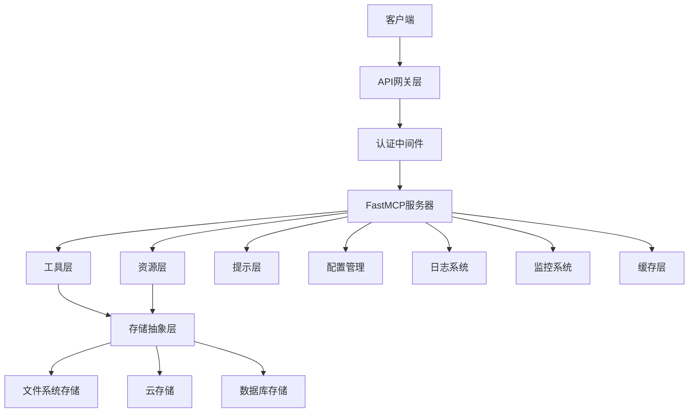
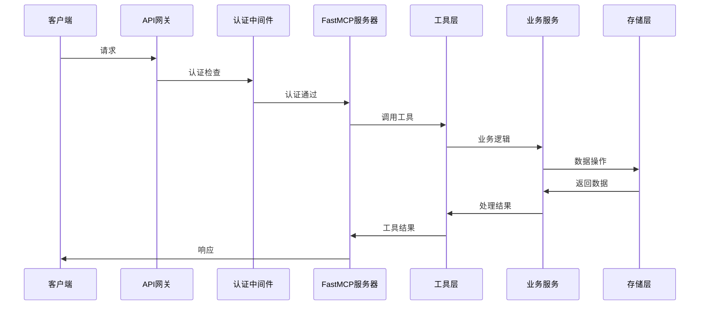

# 基于FastMCP的MCP-Scratchpad全新架构设计

## 1. 现有架构分析

### 1.1 优点

- **功能完整性**: 实现了文件列表、读取、写入、删除等核心功能
- **多传输协议支持**: 支持STDIO和SSE两种传输方式
- **数据模型清晰**: 使用Pydantic进行数据验证和序列化
- **错误处理统一**: 提供了统一的错误处理机制

### 1.2 缺点和改进点

- **架构复杂**: 手动处理MCP协议细节，代码冗余
- **缺乏装饰器模式**: 没有利用现代Python装饰器的简洁性
- **存储扩展性差**: 仅支持文件系统存储，缺乏抽象层
- **缺乏企业级特性**: 无认证、日志、监控等功能
- **配置管理简陋**: 缺乏灵活的配置管理机制
- **测试覆盖不足**: 缺乏完整的测试框架

## 2. 整体架构设计

### 2.1 架构原则

- **装饰器优先**: 充分利用FastMCP的装饰器模式
- **模块化设计**: 清晰的模块边界和职责分离
- **可扩展性**: 支持多种存储后端和传输协议
- **企业级特性**: 内置认证、日志、监控等
- **云原生**: 支持容器化部署和微服务架构

### 2.2 核心组件架构



### 2.3 分层架构

#### 2.3.1 接口层 (Interface Layer)

- **FastMCP服务器**: 基于FastMCP框架的主服务器
- **传输协议**: STDIO、HTTP、SSE多协议支持
- **API网关**: 统一的请求入口和路由

#### 2.3.2 业务逻辑层 (Business Logic Layer)

- **工具服务**: 文件操作工具实现
- **资源服务**: 文件资源管理
- **提示服务**: 智能提示生成

#### 2.3.3 中间件层 (Middleware Layer)

- **认证中间件**: JWT、OAuth2等认证支持
- **授权中间件**: 基于角色的访问控制
- **日志中间件**: 请求日志和审计
- **监控中间件**: 性能监控和指标收集

#### 2.3.4 基础设施层 (Infrastructure Layer)

- **存储抽象**: 统一的存储接口
- **配置管理**: 多环境配置支持
- **缓存系统**: Redis缓存集成
- **消息队列**: 异步任务处理

## 3. 目录结构设计

```
packages/mcp-scratchpad/
├── src/
│   └── mcp_scratchpad/
│       ├── __init__.py
│       ├── main.py                    # 应用入口
│       ├── server.py                  # FastMCP服务器配置
│       │
│       ├── core/                      # 核心模块
│       │   ├── __init__.py
│       │   ├── config.py              # 配置管理
│       │   ├── exceptions.py          # 自定义异常
│       │   ├── dependencies.py        # 依赖注入
│       │   └── constants.py           # 常量定义
│       │
│       ├── models/                    # 数据模型
│       │   ├── __init__.py
│       │   ├── file_models.py         # 文件相关模型
│       │   ├── request_models.py      # 请求模型
│       │   ├── response_models.py     # 响应模型
│       │   └── config_models.py       # 配置模型
│       │
│       ├── storage/                   # 存储层
│       │   ├── __init__.py
│       │   ├── base.py                # 存储抽象基类
│       │   ├── filesystem.py          # 文件系统实现
│       │   ├── s3.py                  # S3存储实现
│       │   ├── database.py            # 数据库存储实现
│       │   └── factory.py             # 存储工厂
│       │
│       ├── tools/                     # 工具实现
│       │   ├── __init__.py
│       │   ├── file_tools.py          # 文件操作工具
│       │   ├── batch_tools.py         # 批量操作工具
│       │   └── search_tools.py        # 搜索工具
│       │
│       ├── resources/                 # 资源管理
│       │   ├── __init__.py
│       │   ├── file_resources.py      # 文件资源
│       │   └── metadata_resources.py  # 元数据资源
│       │
│       ├── prompts/                   # 提示管理
│       │   ├── __init__.py
│       │   ├── file_prompts.py        # 文件相关提示
│       │   └── analysis_prompts.py    # 分析提示
│       │
│       ├── middleware/                # 中间件
│       │   ├── __init__.py
│       │   ├── auth.py                # 认证中间件
│       │   ├── logging.py             # 日志中间件
│       │   ├── monitoring.py          # 监控中间件
│       │   └── rate_limit.py          # 限流中间件
│       │
│       ├── services/                  # 业务服务
│       │   ├── __init__.py
│       │   ├── file_service.py        # 文件服务
│       │   ├── auth_service.py        # 认证服务
│       │   ├── cache_service.py       # 缓存服务
│       │   └── monitoring_service.py  # 监控服务
│       │
│       └── utils/                     # 工具函数
│           ├── __init__.py
│           ├── validators.py          # 验证器
│           ├── formatters.py          # 格式化器
│           ├── security.py            # 安全工具
│           └── helpers.py             # 辅助函数
│
├── tests/                             # 测试目录
│   ├── __init__.py
│   ├── conftest.py                    # pytest配置
│   ├── unit/                          # 单元测试
│   ├── integration/                   # 集成测试
│   └── e2e/                          # 端到端测试
│
├── config/                            # 配置文件
│   ├── development.yaml               # 开发环境配置
│   ├── production.yaml                # 生产环境配置
│   └── testing.yaml                   # 测试环境配置
│
├── deployment/                        # 部署配置
│   ├── docker/                        # Docker配置
│   ├── kubernetes/                    # K8s配置
│   └── terraform/                     # 基础设施代码
│
├── docs/                              # 文档
│   ├── api/                           # API文档
│   ├── deployment/                    # 部署文档
│   └── development/                   # 开发文档
│
├── scripts/                           # 脚本
│   ├── setup.sh                       # 环境设置
│   ├── migrate.py                     # 数据迁移
│   └── deploy.sh                      # 部署脚本
│
├── pyproject.toml                     # 项目配置
├── README.md                          # 项目说明
├── CHANGELOG.md                       # 变更日志
└── LICENSE                            # 许可证
```

## 4. 核心模块设计

### 4.1 FastMCP服务器配置

```python
# src/mcp_scratchpad/server.py
from fastmcp import FastMCP
from fastmcp.server.middleware import Middleware
from .core.config import Settings
from .middleware.auth import AuthMiddleware
from .middleware.logging import LoggingMiddleware
from .middleware.monitoring import MonitoringMiddleware

def create_server(settings: Settings) -> FastMCP:
    """创建FastMCP服务器实例"""
    mcp = FastMCP(
        name="MCP Scratchpad",
        version="2.0.0",
        description="现代化文件管理MCP服务器"
    )
    
    # 添加中间件
    mcp.add_middleware(LoggingMiddleware())
    mcp.add_middleware(MonitoringMiddleware())
    mcp.add_middleware(AuthMiddleware())
    
    # 注册工具、资源和提示
    register_tools(mcp)
    register_resources(mcp)
    register_prompts(mcp)
    
    return mcp
```

### 4.2 存储抽象层设计

```python
# src/mcp_scratchpad/storage/base.py
from abc import ABC, abstractmethod
from typing import List, Optional, Dict, Any
from ..models.file_models import FileRecord, FileMetadata

class StorageBackend(ABC):
    """存储后端抽象基类"""
    
    @abstractmethod
    async def list_files(
        self,
        session_id: str,
        filters: Optional[Dict[str, Any]] = None
    ) -> List[FileRecord]:
        """列出文件"""
        pass
    
    @abstractmethod
    async def read_file(
        self,
        session_id: str,
        file_path: str
    ) -> FileRecord:
        """读取文件"""
        pass
    
    @abstractmethod
    async def write_file(
        self,
        session_id: str,
        file_path: str,
        content: str,
        metadata: Optional[Dict[str, Any]] = None
    ) -> FileRecord:
        """写入文件"""
        pass
    
    @abstractmethod
    async def delete_file(
        self,
        session_id: str,
        file_path: str
    ) -> bool:
        """删除文件"""
        pass
    
    @abstractmethod
    async def get_metadata(
        self,
        session_id: str,
        file_path: str
    ) -> FileMetadata:
        """获取文件元数据"""
        pass
```

### 4.3 工具层设计

```python
# src/mcp_scratchpad/tools/file_tools.py
from fastmcp import Context
from ..services.file_service import FileService
from ..models.request_models import ListFilesRequest, ReadFileRequest

class FileTools:
    """文件操作工具类"""
    
    def __init__(self, file_service: FileService):
        self.file_service = file_service
    
    async def list_files(
        self,
        request: ListFilesRequest,
        ctx: Context
    ) -> Dict[str, Any]:
        """列出文件工具"""
        await ctx.info(f"正在列出会话 {request.session_id} 的文件")
        
        files = await self.file_service.list_files(
            session_id=request.session_id,
            filters=request.filters
        )
        
        await ctx.report_progress(100, 100, "文件列表获取完成")
        
        return {
            "files": [file.to_dict() for file in files],
            "total": len(files)
        }
    
    async def read_file(
        self,
        request: ReadFileRequest,
        ctx: Context
    ) -> Dict[str, Any]:
        """读取文件工具"""
        await ctx.info(f"正在读取文件: {request.file_path}")
        
        file_record = await self.file_service.read_file(
            session_id=request.session_id,
            file_path=request.file_path,
            start_line=request.start_line,
            end_line=request.end_line
        )
        
        return file_record.to_dict()
```

### 4.4 配置管理设计

```python
# src/mcp_scratchpad/core/config.py
from pydantic import BaseSettings, Field
from typing import Optional, Dict, Any

class StorageConfig(BaseSettings):
    """存储配置"""
    backend: str = Field(default="filesystem", description="存储后端类型")
    base_path: Optional[str] = Field(default=None, description="文件系统基础路径")
    s3_bucket: Optional[str] = Field(default=None, description="S3存储桶")
    s3_region: Optional[str] = Field(default=None, description="S3区域")
    
class AuthConfig(BaseSettings):
    """认证配置"""
    enabled: bool = Field(default=False, description="是否启用认证")
    jwt_secret: Optional[str] = Field(default=None, description="JWT密钥")
    oauth_provider: Optional[str] = Field(default=None, description="OAuth提供商")
    
class MonitoringConfig(BaseSettings):
    """监控配置"""
    enabled: bool = Field(default=True, description="是否启用监控")
    metrics_port: int = Field(default=9090, description="监控端口")
    log_level: str = Field(default="INFO", description="日志级别")

class Settings(BaseSettings):
    """主配置类"""
    app_name: str = Field(default="MCP Scratchpad", description="应用名称")
    app_version: str = Field(default="2.0.0", description="应用版本")
    debug: bool = Field(default=False, description="调试模式")
    
    storage: StorageConfig = StorageConfig()
    auth: AuthConfig = AuthConfig()
    monitoring: MonitoringConfig = MonitoringConfig()
    
    class Config:
        env_file = ".env"
        env_nested_delimiter = "__"
```

## 5. API设计和数据流

### 5.1 工具API设计

```python
# 文件列表工具
@mcp.tool
async def list_files(
    session_id: str,
    persistent: Optional[bool] = None,
    keyword: Optional[str] = None,
    namespace: Optional[str] = None,
    agent_name: Optional[str] = None,
    ctx: Context
) -> Dict[str, Any]:
    """列出会话文件，支持多种过滤条件"""
    pass

# 文件读取工具
@mcp.tool
async def read_file(
    session_id: str,
    file_path: str,
    start_line: Optional[int] = None,
    end_line: Optional[int] = None,
    ctx: Context
) -> Dict[str, Any]:
    """读取文件内容，支持行范围"""
    pass

# 文件写入工具
@mcp.tool
async def write_file(
    session_id: str,
    file_path: str,
    content: str,
    overwrite: bool = False,
    persistent: bool = False,
    permission: str = "read_write",
    ctx: Context
) -> Dict[str, Any]:
    """写入文件内容"""
    pass

# 文件删除工具
@mcp.tool
async def delete_file(
    session_id: str,
    file_path: str,
    force: bool = False,
    expected_version: Optional[int] = None,
    ctx: Context
) -> Dict[str, Any]:
    """删除文件"""
    pass
```

### 5.2 资源API设计

```python
# 文件资源
@mcp.resource("scratchpad://files/{session_id}/{file_path}")
async def get_file_resource(
    session_id: str,
    file_path: str,
    ctx: Context
) -> str:
    """获取文件资源"""
    pass

# 会话元数据资源
@mcp.resource("scratchpad://sessions/{session_id}/metadata")
async def get_session_metadata(
    session_id: str,
    ctx: Context
) -> Dict[str, Any]:
    """获取会话元数据"""
    pass

# 系统状态资源
@mcp.resource("scratchpad://system/status")
async def get_system_status(ctx: Context) -> Dict[str, Any]:
    """获取系统状态"""
    pass
```

### 5.3 提示API设计

```python
# 文件分析提示
@mcp.prompt
async def analyze_file(
    file_path: str,
    analysis_type: str = "general",
    ctx: Context
) -> str:
    """生成文件分析提示"""
    pass

# 代码审查提示
@mcp.prompt
async def code_review(
    file_paths: List[str],
    focus_areas: Optional[List[str]] = None,
    ctx: Context
) -> str:
    """生成代码审查提示"""
    pass
```

### 5.4 数据流设计



## 6. 安全性和性能考虑

### 6.1 安全性设计

#### 6.1.1 认证和授权

- **JWT认证**: 支持JWT令牌认证
- **OAuth2集成**: 支持第三方OAuth2提供商
- **RBAC权限**: 基于角色的访问控制
- **API密钥**: 支持API密钥认证

#### 6.1.2 数据安全

- **输入验证**: 严格的输入参数验证
- **路径安全**: 防止路径遍历攻击
- **文件权限**: 细粒度的文件访问控制
- **数据加密**: 敏感数据加密存储

#### 6.1.3 网络安全

- **HTTPS支持**: 强制HTTPS传输
- **CORS配置**: 跨域请求控制
- **限流保护**: API调用频率限制
- **请求大小限制**: 防止大文件攻击

### 6.2 性能优化

#### 6.2.1 缓存策略

- **Redis缓存**: 文件元数据缓存
- **内存缓存**: 热点数据内存缓存
- **CDN集成**: 静态资源CDN加速
- **缓存失效**: 智能缓存失效机制

#### 6.2.2 并发处理

- **异步IO**: 全异步架构设计
- **连接池**: 数据库连接池管理
- **任务队列**: 异步任务处理
- **负载均衡**: 多实例负载均衡

#### 6.2.3 存储优化

- **分片存储**: 大文件分片存储
- **压缩存储**: 文件压缩算法
- **索引优化**: 文件索引优化
- **清理策略**: 定期清理临时文件

## 7. 部署和配置策略

### 7.1 容器化部署

```dockerfile
# Dockerfile
FROM python:3.11-slim

WORKDIR /app

# 安装系统依赖
RUN apt-get update && apt-get install -y \
    gcc \
    && rm -rf /var/lib/apt/lists/*

# 安装Python依赖
COPY pyproject.toml .
RUN pip install --no-cache-dir -e .

# 复制应用代码
COPY src/ ./src/
COPY config/ ./config/

# 创建非root用户
RUN useradd --create-home --shell /bin/bash app
USER app

# 暴露端口
EXPOSE 8000 9090

# 启动命令
CMD ["python", "-m", "mcp_scratchpad.main"]
```

### 7.2 Kubernetes部署

```yaml
# deployment/kubernetes/deployment.yaml
apiVersion: apps/v1
kind: Deployment
metadata:
  name: mcp-scratchpad
  labels:
    app: mcp-scratchpad
spec:
  replicas: 3
  selector:
    matchLabels:
      app: mcp-scratchpad
  template:
    metadata:
      labels:
        app: mcp-scratchpad
    spec:
      containers:
      - name: mcp-scratchpad
        image: mcp-scratchpad:latest
        ports:
        - containerPort: 8000
        - containerPort: 9090
        env:
        - name: STORAGE__BACKEND
          value: "s3"
        - name: STORAGE__S3_BUCKET
          value: "mcp-scratchpad"
        - name: AUTH__ENABLED
          value: "true"
        resources:
          requests:
            memory: "256Mi"
            cpu: "250m"
          limits:
            memory: "512Mi"
            cpu: "500m"
        livenessProbe:
          httpGet:
            path: /health
            port: 8000
          initialDelaySeconds: 30
          periodSeconds: 10
        readinessProbe:
          httpGet:
            path: /ready
            port: 8000
          initialDelaySeconds: 5
          periodSeconds: 5
```

### 7.3 配置管理

```yaml
# config/production.yaml
app:
  name: "MCP Scratchpad"
  version: "2.0.0"
  debug: false

storage:
  backend: "s3"
  s3_bucket: "mcp-scratchpad-prod"
  s3_region: "us-west-2"

auth:
  enabled: true
  jwt_secret: "${JWT_SECRET}"
  oauth_provider: "google"

monitoring:
  enabled: true
  metrics_port: 9090
  log_level: "INFO"

cache:
  enabled: true
  redis_url: "${REDIS_URL}"
  ttl: 3600
```

### 7.4 监控和日志

```python
# src/mcp_scratchpad/middleware/monitoring.py
from prometheus_client import Counter, Histogram, Gauge
import time
from fastmcp import Context

# 监控指标
REQUEST_COUNT = Counter('mcp_requests_total', 'Total requests', ['method', 'status'])
REQUEST_DURATION = Histogram('mcp_request_duration_seconds', 'Request duration')
ACTIVE_CONNECTIONS = Gauge('mcp_active_connections', 'Active connections')

class MonitoringMiddleware:
    """监控中间件"""
    
    async def on_call_tool(self, context, call_next):
        start_time = time.time()
        ACTIVE_CONNECTIONS.inc()
        
        try:
            result = await call_next(context)
            REQUEST_COUNT.labels(
                method=context.request.method,
                status='success'
            ).inc()
            return result
        except Exception as e:
            REQUEST_COUNT.labels(
                method=context.request.method,
                status='error'
            ).inc()
            raise
        finally:
            duration = time.time() - start_time
            REQUEST_DURATION.observe(duration)
            ACTIVE_CONNECTIONS.dec()
```

## 8. 迁移计划和兼容性考虑

### 8.1 迁移策略

#### 8.1.1 阶段性迁移

1. **阶段1**: 新架构并行部署，保持旧系统运行
2. **阶段2**: 数据迁移和功能验证
3. **阶段3**: 逐步切换流量到新系统
4. **阶段4**: 旧系统下线和清理

#### 8.1.2 数据迁移

```python
# scripts/migrate.py
import asyncio
from pathlib import Path
from src.mcp_scratchpad.storage.factory import StorageFactory
from src.mcp_scratchpad.core.config import Settings

async def migrate_data():
    """数据迁移脚本"""
    settings = Settings()
    
    # 旧存储（文件系统）
    old_storage = StorageFactory.create("filesystem", {"base_path": "out/files"})
    
    # 新存储（S3）
    new_storage = StorageFactory.create("s3", {
        "bucket": settings.storage.s3_bucket,
        "region": settings.storage.s3_region
    })
    
    # 迁移所有会话数据
    for session_dir in Path("out/files").iterdir():
        if session_dir.is_dir():
            session_id = session_dir.name
            await migrate_session(old_storage, new_storage, session_id)

async def migrate_session(old_storage, new_storage, session_id):
    """迁移单个会话数据"""
    files = await old_storage.list_files(session_id)
    
    for file_record in files:
        await new_storage.write_file(
            session_id=session_id,
            file_path=file_record.file_path,
            content=file_record.content,
            metadata=file_record.metadata
        )
        print(f"Migrated: {file_record.file_path}")

if __name__ == "__main__":
    asyncio.run(migrate_data())
```

### 8.2 兼容性保证

#### 8.2.1 API兼容性

- **版本控制**: API版本管理
- **向后兼容**: 保持旧API格式支持
- **废弃通知**: 提前通知API变更
- **迁移工具**: 提供API迁移工具

#### 8.2.2 数据兼容性

- **格式转换**: 自动数据格式转换
- **元数据映射**: 旧元数据到新格式映射
- **验证检查**: 数据完整性验证
- **回滚机制**: 迁移失败回滚

### 8.3 测试策略

#### 8.3.1 兼容性测试

```python
# tests/integration/test_compatibility.py
import pytest
from src.mcp_scratchpad.server import create_server
from src.mcp_scratchpad.core.config import Settings

@pytest.mark.asyncio
async def test_api_compatibility():
    """测试API兼容性"""
    settings = Settings()
    server = create_server(settings)
    
    # 测试旧API格式
    old_request = {
        "session_id": "test_session",
        "file_path": "test.txt"
    }
    
    result = await server._mcp_call_tool("read_file", old_request)
    assert result["content"] is not None
    
    # 测试新API格式
    new_request = {
        "session_id": "test_session",
        "file_path": "test.txt",
        "start_line": 1,
        "end_line": 10
    }
    
    result = await server._mcp_call_tool("read_file", new_request)
    assert result["content"] is not None

@pytest.mark.asyncio
async def test_data_migration():
    """测试数据迁移"""
    # 迁移前后数据一致性测试
    pass
```

## 9. 总结

本架构设计基于FastMCP框架，充分利用了其装饰器模式、Context管理、中间件系统等现代化特性，相比现有架构具有以下优势：

### 9.1 技术优势

- **代码简洁**: 装饰器模式大幅减少样板代码
- **功能丰富**: 内置认证、监控、缓存等企业级特性
- **扩展性强**: 模块化设计支持多种存储后端
- **性能优异**: 异步架构和多层缓存优化

### 9.2 运维优势

- **云原生**: 支持容器化和Kubernetes部署
- **可观测**: 完整的监控、日志和指标体系
- **高可用**: 多实例部署和负载均衡支持
- **易维护**: 清晰的模块边界和标准化配置

### 9.3 业务优势

- **功能完整**: 保持所有现有功能并增强
- **用户体验**: 更好的错误处理和进度报告
- **安全保障**: 多层次的安全防护机制
- **成本效益**: 优化的存储和计算资源使用

这个架构设计为MCP-Scratchpad项目提供了一个现代化、可扩展、企业级的解决方案，能够满足当前和未来的业务需求。
